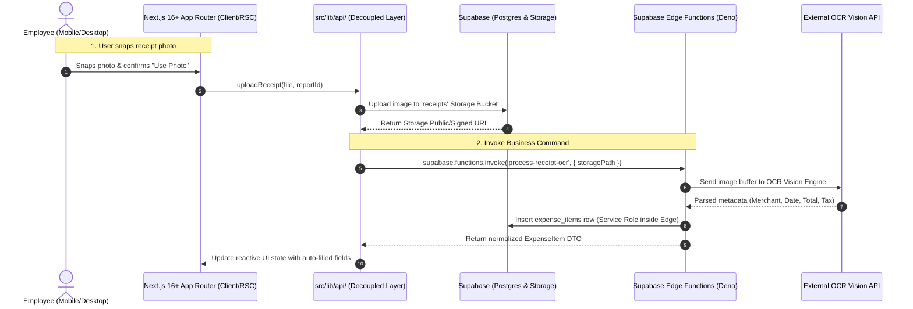

# Sample Architecture Specification: Mobile Expense Management System

**Initiative**: Mobile Expense Reporting & OCR Ingestion  
**Inputs Grounding**:  
- Stories: [sample_user_stories.md](file:///Users/sumeetmehta/Projects/custom-agents-swarm/artifacts/user-stories/sample_user_stories.md)  
- Visual Design: [sample_hifi_mockup.html](file:///Users/sumeetmehta/Projects/custom-agents-swarm/artifacts/visual-designs/sample_hifi_mockup.html)

---

## 1. System Topology & Data Flow



---

## 2. Component & Directory Layout

```text
src/
├── app/
│   ├── (auth)/login/page.tsx           # Authentication page
│   ├── (dashboard)/reports/page.tsx    # RSC Report list view
│   ├── (dashboard)/reports/[id]/page.tsx # Report detail & expense item manager
│   └── layout.tsx                      # Root layout with fonts & theme provider
├── components/
│   ├── ui/                             # shadcn/ui primitives (button, dialog, input)
│   └── expenses/
│       ├── receipt-scanner-modal.tsx   # Camera capture client component
│       ├── expense-item-row.tsx        # Presentational item card
│       └── category-selector.tsx       # Accessible category picker
├── lib/
│   ├── supabase/
│   │   ├── client.ts                   # createBrowserClient()
│   │   ├── server.ts                   # createServerClient()
│   │   └── middleware.ts               # updateSession()
│   ├── api/
│   │   ├── reports.ts                  # Report queries and mutations
│   │   └── expenses.ts                 # Expense item commands & Edge Function invocations
│   └── types/
│       ├── database.types.ts           # Auto-generated Supabase schema types
│       └── expense.types.ts            # Domain DTOs and command payloads
supabase/
├── config.toml                         # Supabase CLI local project configuration
├── migrations/
│   └── 20261001000000_init_expenses.sql # Initial schema, indexes & RLS policies
└── functions/
    └── process-receipt-ocr/
        └── index.ts                    # Deno Edge Function for OCR processing
```

---

## 3. Local Development & Docker Specification

- **Docker Requirement**: **Required for local development.**
- Developers execute `supabase start` using the Supabase CLI, which requires a running Docker daemon to provision local PostgreSQL, Storage, Auth, and Edge Function containers.
