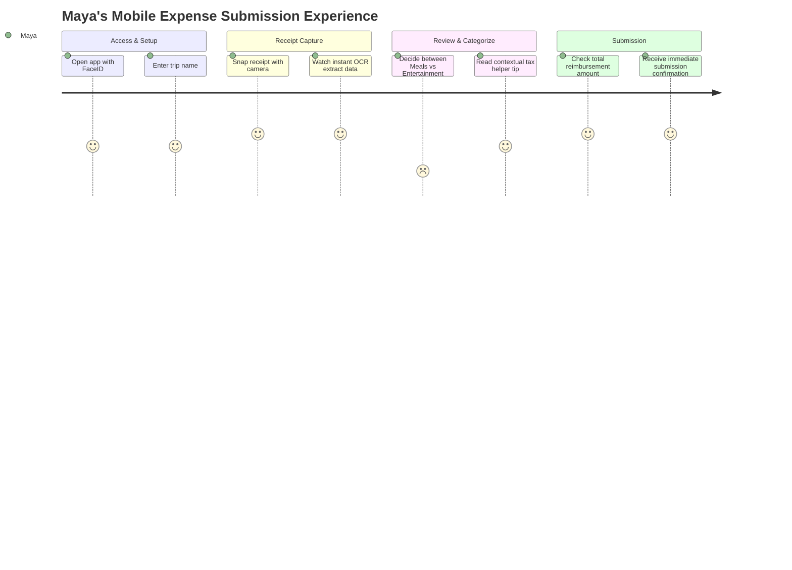

# Sample User Journey Map: Mobile Receipt Capture & Expense Submission

**Persona**: Maya, Senior Field Sales Consultant (Travels 3 days/week)  
**Scenario**: Submitting dinner and taxi receipts from an airport terminal before catching an evening flight.  
**Scope Origin**: [sample_story_map.md](file:///Users/sumeetmehta/Projects/custom-agents-swarm/artifacts/story-maps/sample_story_map.md) (Backbone: Access -> Initiate -> Capture -> Categorize -> Review).

---

## 1. Visual Journey Matrix

| Journey Phase | 1. Access & App Launch | 2. Initiate Trip Report | 3. Snap Receipts | 4. Categorization | 5. Review & Submit |
| :--- | :--- | :--- | :--- | :--- | :--- |
| **User Action** | Opens mobile app while waiting at gate | Taps "New Expense Report", enters trip name "Chicago Q3" | Snaps 2 crumpled paper receipts with camera | Reviews auto-extracted fields, selects category | Verifies total amount, taps "Submit to Manager" |
| **Thoughts & Doubts**| *"Do I remember my password? Will this sync if my wifi drops?"* | *"Can I just duplicate my last Chicago trip?"* | *"Is the lighting good enough? Did it catch the tax total?"* | *"Is client dinner under 'Meals' or 'Entertainment'?"* | *"Did it go through? Will I get reimbursed this Friday?"* |
| **Touchpoint** | Mobile App (iOS / Android), Biometric Prompt | Report Header Modal, Keyboard | Native Camera Viewfinder, OCR Progress Bar | Dropdown Picker, Smart Suggestion Chip | Summary Screen, Success Toast Notification |
| **Emotional Score**| Neutral (`0`) | Confident (`+1`) | Delighted (`+2`) | Hesitant (`-1`) | Relieved / Delighted (`+2`) |
| **Pain Points** | Slow cold start time on poor airport cellular signal | Manually typing repetitive trip dates | Low lighting causes camera focus hunt on crumpled thermal receipt | Unclear distinction between Meals and Client Entertainment | Lack of clear visibility on approval timeline |
| **Design Opportunity** | Offline caching with instant biometric login | Auto-fill trip dates from device location & calendar | Instant edge-detection with auto-flash toggle and haptic shutter feedback | Contextual helper tooltip explaining tax rules with smart default | Visual status timeline tracking manager approval progress |

---

## 2. Mermaid Experience Flow Diagram



---

## 3. FigJam & Miro Importable CSV

```csv
Phase,Dimension,Content,SentimentScore,Notes
"1. Access & Setup","User Action","Opens mobile app with FaceID while waiting at gate","0","Airport terminal"
"1. Access & Setup","User Thought","'I hope this doesn't take 20 minutes to fill out'","-1","Anticipation"
"1. Access & Setup","Pain Point","Slow cellular load time on poor airport WiFi","-1","Network latency"
"1. Access & Setup","Design Opportunity","Offline caching with background syncing","+2","UX improvement"
"2. Initiate Report","User Action","Taps 'New Expense Report' and labels trip 'Chicago Q3'","+1","Report setup"
"2. Initiate Report","User Thought","'Can I just clone my last trip to save time?'","0","Desire for speed"
"2. Initiate Report","Design Opportunity","Auto-populate trip dates from calendar invite","+2","Smart defaults"
"3. Snap Receipts","User Action","Snaps 2 crumpled paper receipts with native camera","+2","Core interaction"
"3. Snap Receipts","User Thought","'Is the lighting good enough to capture total?'","0","Accuracy concern"
"3. Snap Receipts","Pain Point","Crumpled thermal paper receipt glares under fluorescent light","-1","Lighting issue"
"3. Snap Receipts","Design Opportunity","Edge detection auto-crop and auto-contrast filter","+2","Computer vision"
"4. Categorization","User Action","Reviews extracted fields, chooses GL account code","-1","Decision friction"
"4. Categorization","User Thought","'Is this client dinner classified as Meals or Entertainment?'","-1","Tax doubt"
"4. Categorization","Pain Point","Confusion over IRS audit rules for business entertainment","-2","Compliance barrier"
"4. Categorization","Design Opportunity","Contextual suggestion chips based on merchant code","+2","Cognitive ease"
"5. Review & Submit","User Action","Reviews total summary card, taps 'Submit to Manager'","+2","Completion"
"5. Review & Submit","User Thought","'Will I get reimbursed in this week's payroll run?'","+1","Payoff expectation"
"5. Review & Submit","Design Opportunity","Animated success receipt with estimated deposit date badge","+2","Reassurance"
```
